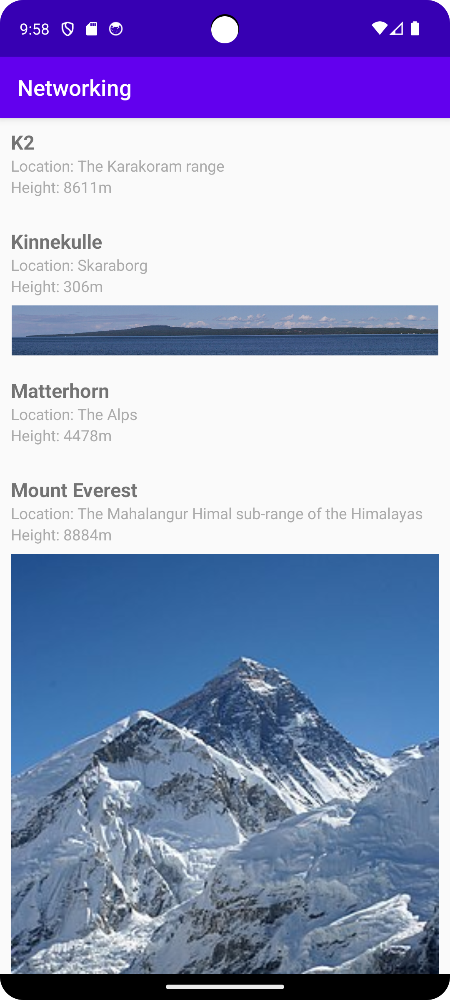

# Rapport


## Report Dugga 5

In this dugga we print data from json and display it with a recyclerview. I have chosen to use picasso as my image loading library as i find it very simple to use.
In my image I have added some styling to stretch the images to the view width, this works well for images with some height, but smaller images just get stretched. This can be fixed in various ways, however not relevant to the assignment.
Some of the data entries contain an images, others don't. The ones that do get it printed and the others are simply empty, this could be replaced with a placeholder photo.

```java
    public void onBindViewHolder(ViewHolder holder, int position) {
        RecyclerViewItem item = items.get(position);
        if (item instanceof Mountain) {
            Mountain mountain = (Mountain) item;
            holder.name.setText(mountain.getName());
            holder.location.setText("Location: " + mountain.getLocation());
            holder.size.setText("Height: " + mountain.getSize() + "m");
            Log.d("RecyclerViewAdapter", "Img URL: " + mountain.getImg());
            Picasso.get().load(mountain.getAuxdata().getImg()).into(holder.image);

        }
    }
```
The viewholder gets the data from the Mountain class via get functions which in turn are grabbed from the JSON via GSON

```java
            Gson gson = new Gson();

Type listType = new TypeToken<ArrayList<Mountain>>() {}.getType();
// Parse JSON array into list of Mountain objects
List<Mountain> mountains = gson.fromJson(json, listType);

            if (mountains != null) {
        items.clear();
                items.addAll(mountains);
                adapter.notifyDataSetChanged();
                Log.e("MainActivity", "Data sent through");
            } else {
                    Log.e("MainActivity", "Couldn't read json");
                Toast.makeText(MainActivity.this, "Failed to parse JSON", Toast.LENGTH_SHORT).show();
            }
```


